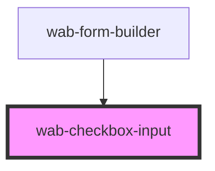

# wab-checkbox-input

<!-- Auto Generated Below -->

## Properties

| Property            | Attribute        | Description                                                        | Type                | Default     |
| ------------------- | ---------------- | ------------------------------------------------------------------ | ------------------- | ----------- |
| `checked`           | `checked`        |                                                                    | `boolean`           | `false`     |
| `details`           | `details`        |                                                                    | `string`            | `undefined` |
| `disabled`          | `disabled`       |                                                                    | `boolean`           | `false`     |
| `errors`            | `errors`         |                                                                    | `string`            | `undefined` |
| `label`             | `label`          |                                                                    | `string`            | `undefined` |
| `labelPosition`     | `label-position` |                                                                    | `"left" \| "right"` | `'right'`   |
| `name` _(required)_ | `name`           |                                                                    | `string`            | `undefined` |
| `readonly`          | `readonly`       |                                                                    | `boolean`           | `false`     |
| `useNative`         | `use-native`     | Use the native checkbox html element instead of the custom css one | `boolean`           | `false`     |
| `value`             | `value`          |                                                                    | `string`            | `undefined` |

## Events

| Event         | Description                                                             | Type                  |
| ------------- | ----------------------------------------------------------------------- | --------------------- |
| `valueChange` | Fired when the value of the input changes, usually on change event      | `CustomEvent<string>` |
| `valueInput`  | Fired when the value of the input changes, usually on input event keyUp | `CustomEvent<string>` |

## Shadow Parts

| Part                     | Description |
| ------------------------ | ----------- |
| `"custominput"`          |             |
| `"custominputcheckmark"` |             |
| `"details"`              |             |
| `"errors"`               |             |
| `"input"`                |             |
| `"label"`                |             |
| `"labeltext"`            |             |

## Dependencies

### Used by

 - [wab-form-builder](../../form-builder)

### Graph

----------------------------------------------

*Built with [StencilJS](https://stenciljs.com/)*
