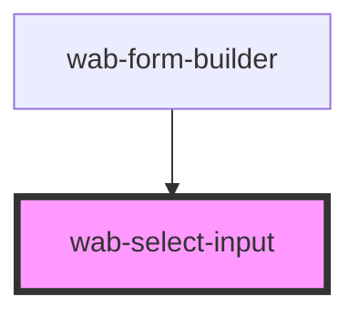

# select-input

<!-- Auto Generated Below -->

## Properties

| Property            | Attribute       | Description                                                                | Type                                  | Default     |
| ------------------- | --------------- | -------------------------------------------------------------------------- | ------------------------------------- | ----------- |
| `details`           | `details`       |                                                                            | `string`                              | `undefined` |
| `disabled`          | `disabled`      |                                                                            | `boolean`                             | `false`     |
| `errors`            | `errors`        |                                                                            | `string`                              | `undefined` |
| `initialValue`      | `initial-value` |                                                                            | `any`                                 | `undefined` |
| `label`             | `label`         |                                                                            | `string`                              | `undefined` |
| `multiple`          | `multiple`      |                                                                            | `boolean`                             | `false`     |
| `name` _(required)_ | `name`          |                                                                            | `string`                              | `undefined` |
| `options`           | --              |                                                                            | `{ label: string; value: string; }[]` | `undefined` |
| `placeholder`       | `placeholder`   |                                                                            | `string`                              | `undefined` |
| `readonly`          | `readonly`      |                                                                            | `boolean`                             | `false`     |
| `value`             | `value`         | The input value if multiple is true, value is a string separated by commas | `any`                                 | `undefined` |

## Events

| Event         | Description                                                             | Type                              |
| ------------- | ----------------------------------------------------------------------- | --------------------------------- |
| `valueChange` | Fired when the value of the input changes, usually on change event      | `CustomEvent<string \| string[]>` |
| `valueInput`  | Fired when the value of the input changes, usually on input event keyUp | `CustomEvent<string \| string[]>` |

## Shadow Parts

| Part              | Description |
| ----------------- | ----------- |
| `"details"`       |             |
| `"dropdown"`      |             |
| `"dropdown-item"` |             |
| `"errors"`        |             |
| `"input"`         |             |
| `"input-wrapper"` |             |
| `"label"`         |             |

## Dependencies

### Used by

 - [wab-form-builder](../../form-builder)

### Graph

----------------------------------------------

*Built with [StencilJS](https://stenciljs.com/)*
