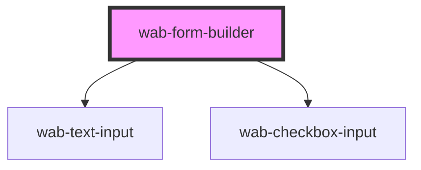

# wab-form-builder

<!-- Auto Generated Below -->

## Properties

| Property  | Attribute | Description | Type                      | Default     |
| --------- | --------- | ----------- | ------------------------- | ----------- |
| `action`  | `action`  |             | `string`                  | `undefined` |
| `loading` | `loading` |             | `boolean`                 | `false`     |
| `method`  | `method`  |             | `string`                  | `undefined` |
| `schema`  | `schema`  |             | `WabFormSchema \| string` | `undefined` |
| `useAjax` | --        |             | `Boolean`                 | `false`     |

## Methods

### `getFormData() => Promise<any>`

#### Returns

Type: `Promise<any>`

## Shadow Parts

| Part          | Description |
| ------------- | ----------- |
| `"resetbtn"`  |             |
| `"submitbtn"` |             |

## Dependencies

### Depends on

- [wab-text-input](../form-controls/text-input)
- [wab-checkbox-input](../form-controls/checkbox-input)

### Graph

----------------------------------------------

*Built with [StencilJS](https://stenciljs.com/)*
