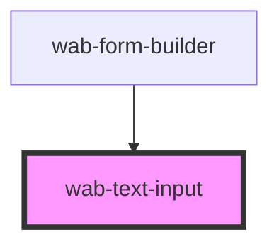

# wab-text-input

<!-- Auto Generated Below -->

## Properties

| Property            | Attribute     | Description | Type      | Default     |
| ------------------- | ------------- | ----------- | --------- | ----------- |
| `details`           | `details`     |             | `string`  | `undefined` |
| `disabled`          | `disabled`    |             | `boolean` | `false`     |
| `errors`            | `errors`      |             | `string`  | `undefined` |
| `label`             | `label`       |             | `string`  | `undefined` |
| `name` _(required)_ | `name`        |             | `string`  | `undefined` |
| `placeholder`       | `placeholder` |             | `string`  | `undefined` |
| `readonly`          | `readonly`    |             | `boolean` | `false`     |
| `type`              | `type`        |             | `string`  | `'text'`    |
| `value`             | `value`       |             | `string`  | `undefined` |

## Events

| Event         | Description                                                             | Type                  |
| ------------- | ----------------------------------------------------------------------- | --------------------- |
| `valueChange` | Fired when the value of the input changes, usually on change event      | `CustomEvent<string>` |
| `valueInput`  | Fired when the value of the input changes, usually on input event keyUp | `CustomEvent<string>` |

## Shadow Parts

| Part        | Description |
| ----------- | ----------- |
| `"details"` |             |
| `"errors"`  |             |
| `"input"`   |             |
| `"label"`   |             |

## Dependencies

### Used by

 - [wab-form-builder](../../form-builder)

### Graph

----------------------------------------------

*Built with [StencilJS](https://stenciljs.com/)*
